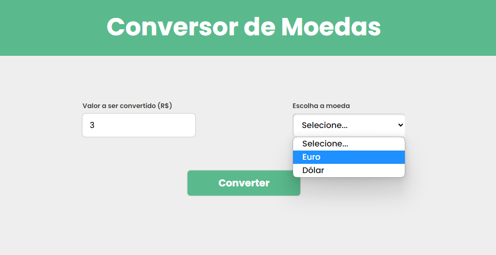
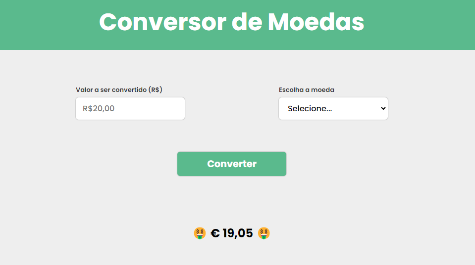

##  Um conversor de moedas [Real ---> Euro ou Dólar]
### Projeto realizado seguindo as aulas do curso de "HTML, CSS e JS na prática" da [Udemy](https://www.udemy.com/course/html5-css3-e-javascript-na-pratica)
 

  </img>

  </img>
 

 

### Tecnologias utilizadas:

 

  
  
  

 

### Visualização do projeto: 

- [Conversor de Moedas](https://udemy-conversor-de-moedas.netlify.app/)
